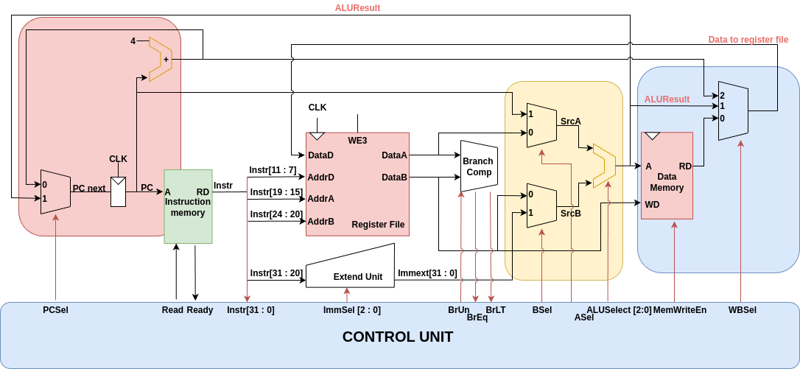

# 🖥️ Single-Cycle RISC-V CPU

## 1. Introduction
This project implements a **Single-Cycle CPU** based on the **RISC-V RV32I instruction set**.  
The CPU executes each instruction in **one clock cycle**, making the datapath simple and suitable for learning computer architecture fundamentals.  

- **Language:** Verilog HDL  
- **Simulation Tools:** QUestasim 
- **ISA Supported:** RV32I Base (Integer) instructions  

---

## 2. Architecture Overview
The CPU datapath consists of the following main components:
- **Program Counter (PC)** – holds the current instruction address.  
- **Instruction Memory** – stores the program (machine code).  
- **Register File** – contains 32 general-purpose registers (x0–x31).  
- **ALU** – performs arithmetic and logic operations.  
- **Data Memory** – load/store access to memory.  
- **Control Unit** – decodes instructions and generates control signals.  
- **Immediate Generator & MUXes** – handle immediate values and data routing.  

 <!-- optional figure -->

---

## 3. Instruction Set Supported
The CPU implements almost the full **RV32I Base ISA**.  

### 🔹 R-type (Register–Register)
- `add`, `sub`, `xor`, `or`, `and`  
- `sll`, `srl`, `sra`  
- `slt`, `sltu`  

### 🔹 I-type (Immediate & Load)
- Arithmetic/logic: `addi`, `xori`, `ori`, `andi`, `slti`, `sltiu`, `slli`, `srli`, `srai`  
- Memory: `lb`, `lh`, `lw`, `lbu`, `lhu`  
- Control: `jalr`  

### 🔹 S-type (Store)
- `sb`, `sh`, `sw`  

### 🔹 B-type (Branch)
- `beq`, `bne`, `blt`, `bge`, `bltu`, `bgeu`  

### 🔹 J-type (Jump)
- `jal`  

### 🔹 U-type (Upper Immediate)
- `lui`, `auipc`  

---

## 4. Datapath Description
- **Arithmetic/Logic (R-type, I-type):**  
  Registers → ALU → Register File.  
- **Load (lw/lb/lh):**  
  ALU computes address → Data Memory read → Register File.  
- **Store (sw/sh/sb):**  
  ALU computes address → Register File value → Data Memory write.  
- **Branch (beq/bne/blt...):**  
  ALU compare → update PC if condition met.  
- **Jump (jal/jalr):**  
  New PC = current PC + offset (or register + offset), return address stored in `x1`.  
- **Immediate (lui/auipc):**  
  Immediate value written to register or added to PC.  

---

## 5. Control Unit
The Control Unit decodes the instruction fields (`opcode`, `funct3`, `funct7`, `BrUn`) and generates control signals:  
- `PCSel`, `Read`, `Ready`,  `ImmSel [2 : 0]`  
- `BrEq`, `BrLT`  
- `ASel`, `BSel`  
- `ALUSelect [2:0]`  
- `MemWriteEn`  
- `WBSel`  

👉 For the **complete control signal table** of all supported instructions, please check this Google Sheet:  
[📑 Control Signal Table](https://docs.google.com/spreadsheets/d/16yg93v6sQOMSJTBV34Ah0uIhboqDeHKh47NLm_6tLl4/edit?usp=sharing)  

---

## 6. Testbench and Verification
All test scenarios are documented in the Google Sheet (assembly code + expected golden outputs from **Ripes simulation**).  

- For **R-type/I-type arithmetic & logic**:  
  - Testbench resets processor, initializes IMEM & Register File.  
  - After each cycle, register values are checked against golden outputs.  

- For **Load/Store**:  
  - Processor reset → IMEM & DMEM initialized.  
  - Each cycle verifies correct load/store behavior.  

- For **Branch/Jump**:  
  - Test different branch conditions (taken & not taken).  
  - Verify PC updates match simulation.  

👉 Detailed scenarios:  
[📑 Test Plan & Verification Google Sheet](https://docs.google.com/spreadsheets/d/16yg93v6sQOMSJTBV34Ah0uIhboqDeHKh47NLm_6tLl4/edit?usp=sharing)  

## 7. References
- David A. Patterson, John L. Hennessy – *Computer Organization and Design RISC-V Edition: The Hardware/Software Interface*.  
- RISC-V Foundation – *The RISC-V Instruction Set Manual, Volume I: Unprivileged ISA, Version 2.2*.  
- [Ripes Simulator](https://github.com/mortbopet/Ripes) – A visual computer architecture simulator used for reference golden outputs.  
- [RISC-V Green Card (Instruction Reference)](https://inst.eecs.berkeley.edu/~cs61c/fa17/img/riscvcard.pdf).  
- [RISC-V International](https://riscv.org/) – official specifications and resources.  
- Lecture notes and lab materials on Computer Architecture (course references).  